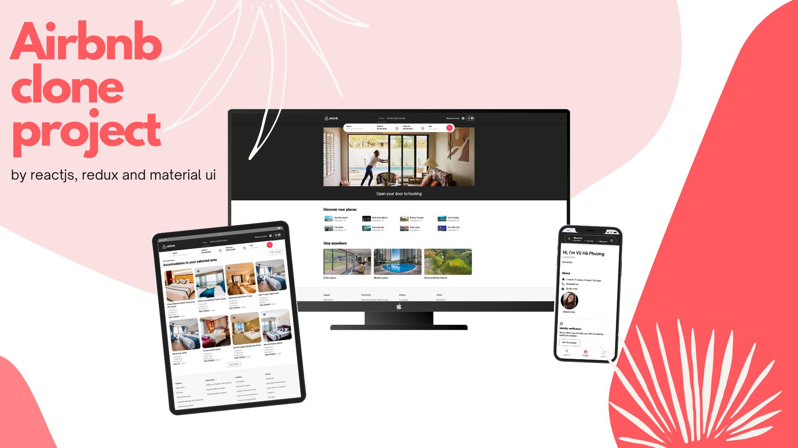

# Airbnb Clone App

An Airbnb clone built with ReactJS, Redux, and Material UI.  
With this app, users can search for accommodation, create filters, and make a reservation.
Visit the live demo: [airbnb]: https://airbnb-five-sandy.vercel.app/

## Features:

For user:

-   Display lists of accommodation according to locations and accommodation types
-   Search accommodation according to location
-   Filter accommodation according to specific preferences
-   Make, delete, edit reservation
-   Create the wish list
-   Sign in, sign out
-   Edit user profile, user's avatar

For administration:

-   Display lists of admins, users and accommodation
-   Add, delete, edit admins and users
-   Add, delete, edit accommodation

## Installation and execution

To install the project, run the following commands:

-   git clone https://github.com/phuongvu0804/reactJS_airbnb.git
-   cd meditation-app

To run the project, run the following command:

-   npm start

To experience more the project, try to sign in with this account:

-   username: phuongvu@airbnb.io
-   password: 123456Phuong@

## Contributors

This project has been done thanks to these awesome contributors:

<table>
  <tr>
    <!-- Phuong Vu -->
    <td align="center"><a href="https://github.com/phuongvu0804"> <b>Phuong Vu (Chloe)</b></a> <a href="https://github.com/scoobytux/movielab/commits?author=phuongvu0804" title="Code">💻</a><a href="https://github.com/scoobytux/movielab/commits?author=phuongvu0804" title="Documentation">📖</a></td>
    <!-- Tu Le -->
    <td align="center"><a href="https://github.com/scoobytux"> <b>Tu Le (Liam)</b></a> <a href="https://github.com/scoobytux/movielab/commits?author=scoobytux" title="Code">💻</a><a href="https://github.com/scoobytux/movielab/commits?author=scoobytux" title="Documentation">📖</a></td>
  </tr>
</table>

## Attribution

The following sources have been used for reference purposes.

-   Airbnb: as the UX/UI inspiration
    -   https://www.airbnb.com/
-   CyberSoft: as the API provider
